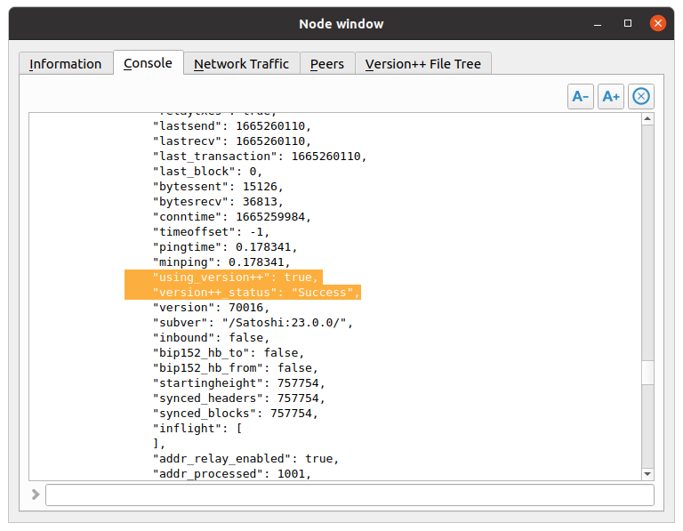
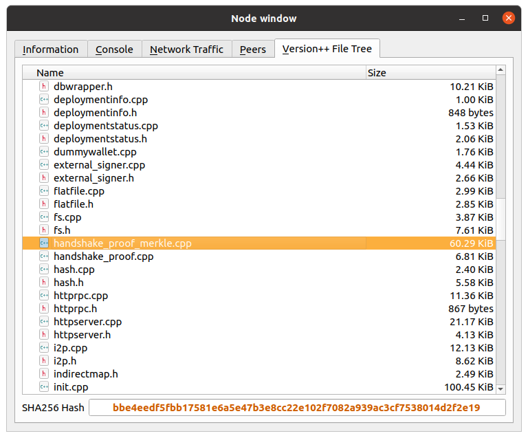

Bitcoin Core: Version++
=====================================

The corresponding implementation to our research paper.

Updated node window             |  Updated getpeerinfo parameters    |  Added file tree tab
:------------------------------:|:----------------------------------:|:------------------------------:
  |    |  

## Paper Publication
A. Sarker, S. Wuthier, J. Kim, J. Kim, and S.-Y. Chang, “Version++: Cryptocurrency blockchain handshaking with software assurance,” in 2023 IEEE 20th Annual Consumer Communications & Networking Conference (CCNC). IEEE, 2023, pp. 1–6.
